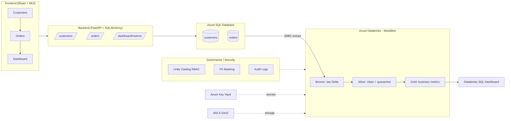

# Architecture - Retail DataSecOps Platform

## End-to-End Flow

## Medallion Layers

| Layer  | Tables | Purpose |
|--------|--------|---------|
| Bronze | `customers_raw`, `orders_raw` | Raw ingest + ingestion timestamp |
| Silver | `customers`, `orders`, `*_quarantine` | Dedupe, validate, standardize, quarantine |
| Gold   | `customer_sales`, `city_revenue`, `daily_revenue`, `data_quality_report`, `audit_log` | Business metrics & governance |

## Workflow (Databricks Job)

`Bronze -> Silver -> Gold -> Data Quality -> Audit`

## CI/CD (Azure DevOps)

`Validate -> Unit Tests -> Bundle Validate -> Bundle Deploy -> Run Workflow`

## Security Controls

- **Secrets**: Azure Key Vault-backed secret scope (`retail-kv`).
- **RBAC**: Unity Catalog grants for `data_engineers`, `analysts`, `admins`.
- **PII masking**: `mask_email`, `mask_phone` column masks on `silver.customers`.
- **Row-level security**: `city_row_filter` restricts analyst row visibility.
- **Audit**: row counts + DQ outcomes captured in `gold.audit_log`.
